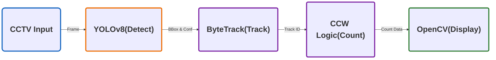

## 🍀 프로젝트 개요

- **"고비용의 물리 센서 없이, 기존 CCTV만으로 가능한 스마트 교통 관제 솔루션"**
- 기존의 루프 검지기나 물리 센서는 설치 및 유지보수 비용이 높다는 단점이 있습니다. 이를 대체하기 위해, **기존 도로 CCTV 영상만으로 차량 흐름을 실시간으로 분석하고 카운팅할 수 있는 AI 비전 솔루션**을 기획하게 되었습니다.

## 🔧 사용 기술

| **분류** | **기술 스택** | **주요 역할 및 활용 이유** |
| --- | --- | --- |
| **Language** | **Python** | 데이터 전처리, 모델 학습 및 분석 파이프라인 구축을 위한 메인 언어 |
| **Framework** | **PyTorch** | YOLOv8 및 ResNet50 모델 구현 및 딥러닝 학습 환경 구축 |
| **Feature Extraction** | **ResNet50** | 제조 부품 이미지로부터 고차원 특징 벡터를 추출하여 데이터 분석에 활용 |
| **Visualization** | **t-SNE** | 고차원의 데이터를 2차원으로 축소하여 제품 A/B 간의 군집 중첩 현상을 시각화 |
| **Clustering** | **K-means** | 추출된 특징 데이터를 바탕으로 레이블 없이 부품 간 유사성을 그룹화하여 분포 확인 |
| **Object Detection** | **YOLOv8** | 실시간 객체 탐지 및 정밀 분류를 수행하는 메인 지도 학습 모델로 활용 |
| **Labeling Tool** | **LabelImg** | 바운딩 박스 기반의 학습 데이터셋 라벨링 수행 |
| Environment | Google Colab | GPU환경을 활용하여 학습 가속화 |
## 🔧 사용 기술  
| Language | Python | 전체 시스템 로직 구현 및 라이브러리 통합  |
| --- | --- | --- |
| AI Model | YOLOv8 | 실시간 객체 탐지  |
| Tracker | SORT, ByteTrack | 객체 추적 및 ID 관리 |
| Library | OpenCV | Native Drawing 기반 시각화 |
| Math | NumPy | CCW 기반 벡터 교차 연산 및 고속 데이터 처리 |

## 📍주요 기능

### **1. 딥러닝 기반 실시간 추적**

- **YOLOv8의 탐지 결과와** **ByteTrack** 알고리즘을 결합하여, 실시간으로 각 차량에 **고유 ID**를 부여해 이동 궤적을 추적하고 ID 스위칭을 최소화하도록 구현.

### **2. 벡터 기반 정밀 카운팅**

- 단순 좌표 비교의 한계를 극복하기 위해, **CCW(벡터 교차) 알고리즘**을 도입하여 프레임 스킵 상황에서도 누락 없는 통행량 집계 구현.

### 3. 차선별 독립 분석

- 도로 전체가 아닌 **좌/우 차선을 독립적으로 분리**하여 개별 차선의 교통량을 정밀하게 산출.

### 4. **엣지 디바이스 최적화**

- OpenCV Native Drawing을 통해 렌더링 오버헤드를 줄여, 저사양 환경에서도 실시간 FPS 방어.
