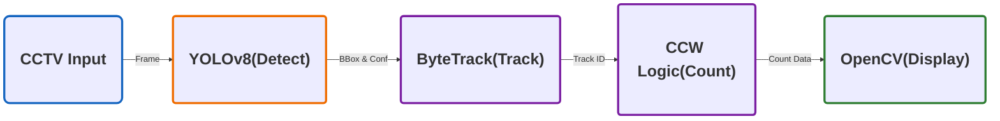

## 🍀 YOLOv8 + ByteTrack + CCW 기반의 지능형 실시간 교통량 분석 시스템 개발
- 기존의 매설형 루프 검지기나 물리 센서는 설치 및 유지보수 비용이 높다는 어려움이 있습니다. 이를 해결하기 위해, 기존 도로 CCTV를 지능형 센서로 전환하여, 실시간 교통량을 효율적으로 분석하는 AI 비전 솔루션을 기획하였습니다.

## 🔧 사용 기술

| **분류** | **기술 스택** | **주요 역할 및 활용 이유** |
| --- | --- | --- |
| Language | Python | 전체 시스템 로직 구현 및 라이브러리 통합  |
| AI Model | YOLOv8 | 차량 객체 실시간 탐지   |
| Tracker | SORT, ByteTrack | 탐지된 객체에 고유 ID 부여 및 프레임 간 궤적 추적 |
| Library | OpenCV | 영상 데이터 처리, 카운팅 라인 시각화 |
| Math | NumPy | 벡터 외적 기반의 CCW 알고리즘을 통한 정밀 교차 판정 |

## 📍주요 기능

### **1. 딥러닝 기반 실시간 추적**

YOLOv8 탐지 결과에 ByteTrack의 2단계 매칭 로직을 적용하여 가려짐(Occlusion)이 빈번한 도로 환경에서도 끊김 없는 추적을 구현.

- 1차 매칭: YOLOv8이 탐지한 객체 중 신뢰도가 높은 박스들을 대상으로 기존 트랙들과 IoU 매칭.
  
- 미매칭 트랙 발생: 가려짐이나 프레임 저하로 인해 객체의 신뢰도가 일시적으로 떨어지면, 해당 객체는 1차 매칭 대상에서 제외되어 트랙이 끊길 위기에 처함.

- 2차 매칭: 1차에서 매칭되지 못한 트랙들을 버리지 않고, 신뢰도가 낮아 삭제될뻔한 신뢰도가 낮은 박스들과 다시 비교하여 IoU매칭을 진행. 

### **2. 벡터 기반 정밀 카운팅**

- CCW(벡터 교차) 알고리즘을 도입하여, 객체의 이동 궤적을 분석하고 프레임 드랍으로 인해 차량이 검지선을 건너뛰는 상황에서도 데이터 누락을 최소화.
- 프레임 드랍이나 고속 주행 시 발생하는 '좌표 도약' 문제를 해결하기 위해, 점(Point) 판별이 아닌 기하학적 선분 교차(Line Segment Intersection) 알고리즘을 도입했습니다.
- 벡터 구성: P1, P2: 고정된 카운팅 라인의 왼쪽/오른쪽 끝
- P3, P4: 차량의 이전 프레임 좌표(P3)와 현재 프레임 좌표(P4)
- 교차 판정: P1, P2를 기준으로 P3가 위쪽(음수), P4가 아래쪽(양수)에 위치해 부호가 반전되는 순간을 포착.
- 핵심 이점: 객체의 이동 궤적(선분) 자체를 분석하므로, 차량이 검지선을 건너뛰는 프레임 드랍 상황에서도 누락을 최소화하여 통행량 집계를 진행.

### 3. 차선별 독립 분석

- 중앙 분리대를 기준으로 도로를 좌/우로 분리하여, 각 차선의 교통량을 정밀하게 측정할 수 있도록 설계.

### 4. **엣지 디바이스 최적화**

- OpenCV Native Drawing 기능을 적용해 렌더링 오버헤드를 줄여, 저사양 환경에서도 실시간 분석 성능을 안정적으로 유지.

