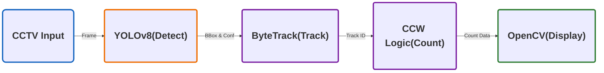

## 🍀 프로젝트 개요

- **"YOLOv8 + ByteTrack + CCW 기반의 지능형 실시간 교통량 분석 시스템"**
- 기존의 매설형 루프 검지기나 물리 센서는 설치 및 유지보수 비용이 높다는 어려움이 있습니다. 이를 해결하기 위해, 기존 도로 CCTV를 지능형 센서로 전환하여, 실시간 교통량을 효율적으로 분석하는 AI 비전 솔루션을 기획하였습니다.

## 🔧 사용 기술

| **분류** | **기술 스택** | **주요 역할 및 활용 이유** |
| --- | --- | --- |
| Language | Python | 전체 시스템 로직 구현 및 라이브러리 통합  |
| AI Model | YOLOv8 | 차량 객체 실시간 탐지   |
| Tracker | SORT, ByteTrack | 탐지된 객체에 고유 ID 부여 및 프레임 간 궤적 추적 |
| Library | OpenCV | 영상 데이터 처리, 카운팅 라인 시각화 |
| Math | NumPy | 벡터 외적 기반의 CCW 알고리즘을 통한 정밀 교차 판정 |

## 📍주요 기능

### **1. 딥러닝 기반 실시간 추적**

- **YOLOv8의 탐지 결과와** **ByteTrack** 알고리즘을 결합하여, 차량이 밀집되어 일부가 가려지더라도 ID를 끝까지 유지함으로써, 동일 차량이 중복 카운팅되거나 추적에서 사라지는 현상을 최소화.

### **2. 벡터 기반 정밀 카운팅**

- CCW(벡터 교차) 알고리즘을 도입하여, 객체의 이동 궤적을 분석하고 프레임 드랍으로 인해 차량이 검지선을 건너뛰는 상황에서도 데이터 누락을 최소화.

### 3. 차선별 독립 분석

- 중앙 분리대를 기준으로 도로를 좌/우로 분리하여, 각 차선의 교통량을 정밀하게 측정할 수 있도록 설계.

### 4. **엣지 디바이스 최적화**

- OpenCV Native Drawing 기능을 적용해 렌더링 오버헤드를 줄여, 저사양 환경에서도 실시간 분석 성능을 안정적으로 유지.

