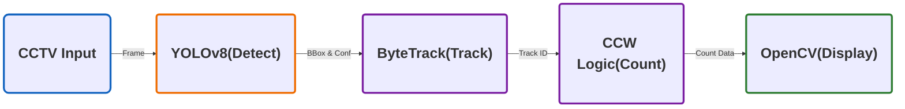

## 🍀 YOLOv8 + ByteTrack + CCW 기반의 지능형 실시간 교통량 분석 시스템 개발
- 기존에 사용되는 매설형 루프 검지기나 물리 센서는 설치 및 유지보수 비용이 높다는 한계가 있음. 
- 이를 해결하기 위해, 기존 도로 CCTV를 지능형 센서로 전환하여, 실시간 교통량을 효율적으로 분석하는 AI 비전 솔루션을 기획.


## 🔧 사용 기술

| **분류** | **기술 스택** | **주요 역할 및 활용 이유** |
| --- | --- | --- |
| Language | Python | 전체 시스템 로직 구현 및 라이브러리 통합  |
| AI Model | YOLOv8 | 차량 객체 실시간 탐지   |
| Tracker | SORT, ByteTrack | 탐지된 객체에 고유 ID 부여 및 프레임 간 궤적 추적 |
| Library | OpenCV | 영상 데이터 처리, 카운팅 라인 시각화 |
| Math | NumPy | 벡터 외적 기반의 CCW 알고리즘을 통한 정밀 교차 판정 |

## 📍주요 기능

### **1. 딥러닝 기반 실시간 추적**

YOLOv8 탐지 결과에 ByteTrack의 2단계 매칭 로직을 적용하여, 차량이 일시적으로 가려져 신뢰도가 낮아져도 끊김 없는 추적 성능을 확보.

- 1차 매칭: YOLOv8이 탐지한 객체 중 신뢰도가 높은 박스들을 대상으로 기존 트랙들과 IoU 매칭.
  
- 미매칭 트랙 발생: 가려짐이나 프레임 저하로 인해 객체의 신뢰도가 일시적으로 낮아지게 되면, 해당 객체는 1차 매칭 대상에서 제외되어 트랙이 끊길 위기에 처함.

- 2차 매칭: 1차에서 매칭되지 못하고 남겨진 트랙과 신뢰도가 낮아 삭제될뻔한 박스들을 다시 비교하여 IoU매칭을 진행. 


### **2. 벡터 기반 정밀 카운팅**
CCW(벡터 교차) 알고리즘을 도입하여, A(카운팅 라인 시작점), B(카운팅 라인 끝점)과 차량의 이동 궤적 선분 C(이전위치), D(현재위치)의 교차 여부를 기하학적으로 판별.

교차 판정 로직
- 방향성 판정: 카운팅 라인(A -> B) 를 기준으로 차량의 이전위치(C)와 현재위치(D)에 대해 각각 CCW연산을 수행.
- 교차 시점: 차량이 선을 통과하면 C와 D의 부호가 서로 반대가 됨.
    - 이때 두 CCW결과값 음수(<0)가 되는 순간을 유효한 교차 시점으로 판단.

- 핵심 이점: 객체의 이동 궤적(선분) 자체를 분석하므로, 연산 부하로 인해 FPS가 저하되어 차량이 카운팅 라인을 건너뛰는 현상이 발생해도 누락을 최소화하여 통행량을 집계.

### 3. 공간 분할 및 차선별 독립 분석
- 중앙 분리대를 기준으로 분석 영역을 좌/우로 분리하여, 각 차선에 독립적인 카운팅 라인과 카운팅 변수를 할당하여 교통량을 정밀하게 산출할 수 있도록 설계.

### 4. **엣지 디바이스 최적화**
실시간 분석 성능 유지를 위해 렌더링 부하를 최소화하도록 설계.
- OpenCV Native Drawing 기능을 적용해 렌더링 오버헤드를 줄여, 저사양 환경에서도 실시간 분석 성능을 안정적으로 유지.


## 📋 프로젝트 실행

- 모델 학습에 사용된 이미지 및 라벨링 데이터셋

```
https://www.kaggle.com/code/farzadnekouei/real-time-traffic-density-estimation-with-yolov8/input
```
## Setup
```
py -3.10 -m venv start
```
```
start\Scripts\activate
```
```
pip install -r requirements.txt
```
```
python main.py
```


